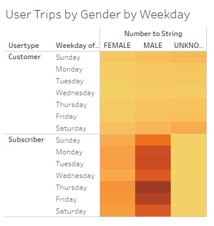

# Bikesharing

## Project Overview
Use the public dataset for Citi Bike in New York City to help investors determine whether a similiar program in Des Moines, Iowa would be a successful venture.
## Purpose
The purpose of the project is to create visualizations with Tableau using Citi Bike data from August, 2019, to assist in the determination of whether or not a bikesharing program would be successful in Des Moines, Iowa.

## Results - [Tableau Story Link](https://public.tableau.com/app/profile/jen.robert7492/viz/CitibikeChallenge_16396673254270/NYCCitibikeAnalysisOutcomes?publish=yes)

 - Checkout Times for Users:  The first visualization demonstrates the average trip duration for users during August, 2019.  We find the typical checkout time for each ride is about 5 minutes.  After that time, the trip duration continues to decline with fewer trips take that last greater than one hour.  We can reasonably conclude that bike sharing is most often used for quick trips and not for multiple hours.

 

 - Checkout Times by Gender:  Male users are the predominent client for Citi Bike.  Males have a typical bike checkout time of about 5 minutes.  Female users are significantly less than male users.  However, females have a typical checkout time of 6 minutes.  For users, where we do not the gender, the max checkout time is about 11 minutes.

 

 - Trips by Weekday per Hour:  This heatmap shows that the highest concentration of bikesharing occurs during the rush hours on weekdays but we see more usage mid day during the weekends.  This seems to indicate that clients are using bikesharing for a quick work commute.

 

 - Trips by Gender by Weekday per Hour:  In further breaking down the above visualization by gender, it further illustrates that males are the predominant user during rush hours.  We can see that where the gender is unknown, there are more trips taken on weekends than during the weekdays.  This may indicate that those with an unknown gender are not subscribers but rather area tourists.

 

 - Usertype Trips by Gender by Weekday: This visualization further illustrates that the usertype, Customer, often of unknown gender and has the greatest amount of trips on the Saturday and Sunday.  Whereas, the usertype of Subscriber is usually a known gender.  The majority of subscribers are male that use the service mostly on the weekdays, particularly at Thursdays and Fridays.  It would seem that our subscribers are use the bikesharing for commuting and customers are using it for weekend activities, possibly sightseeing.

 

 - Top Starting Locations:  The map below shows where the greatest starting locations of trips occur.  Mid to lower Manhattan sees the greatest number of starting trip locations.  The highest coordinates on the map coincide with Grand Central Station Terminal area as the top starting location.  Other top starting locations are located near the Lincoln Tunnel and outside of major tourist destinations.  

 

 - Bike Repairs: Another point to consider is maintenance on the bikes.  We can assume that bikes that are more heavily used are likely going to need more maintenance and repairs.  The treemap below shows bikes that are the most heavily used in red through the least used in blue.  We can use this information to determine how many bikes will be in need of repair in the future.

 

## Summary
In conclusion, it seems that a bikesharing program is more heavily utilized in busier, more commercial areas.  Areas that lean towards less commercial and more residential have a lower usage.  The service seems to have strong subscriber base comprising mostly of male users during peak rush hours during the weekdays.  Top starting locations are found at major transportation hubs and popular tourist attractions with trips being short.

Other visualizations to explore may include:
 - Top Ending Locations by Usertype to determine where subscribers are ending up versus customers.  Could there be a potential need to relocate more bikes to those areas for a return trip?  
 - Length of Trip Duration by Usertype to determine who might be using the bikes for longer trips.
 - Analyze other monthly data other than August to determine how the bikesharing is utilized in less busy months.
 - Analyze weather data with the trip durations to determine how weather will affect trips.
